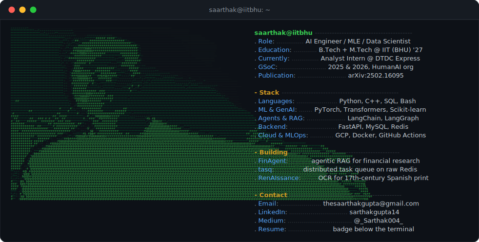

### `saarthak@github:~$ whoami`

  
  
  
  

## Featured Work

- **[FinAgent](https://fin-agent-498211.web.app)** — agentic RAG for financial research on LangGraph. Hybrid BM25 + dense retrieval (+53% retrieval accuracy), numeric verification that refuses uncertain answers (61% → 75% on a finance QA benchmark). Live on Cloud Run.
- **[tasq](https://github.com/sarthakg004/tasq)** — distributed task queue built on raw Redis primitives. Atomic Lua state transitions, at-least-once delivery, lease-based crash recovery. 560 jobs/sec under Locust load tests.
- **[RenAIssance OCR](https://github.com/sarthakg004/RenAIssanceOCR)** — *Google Summer of Code 2026.* CRNN + TrOCR models reading 17th-century Spanish print at 10.6% CER, with a FastAPI backend and React UI.
- **[Remote Sensing Image Captioning](https://arxiv.org/abs/2502.16095)** — published research on CNN representations in transformer-based captioning.

## GitHub Stats

  
  

Contribution activity

